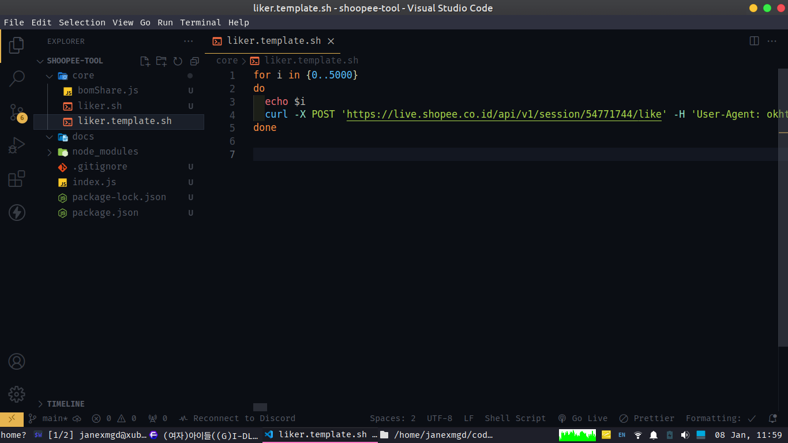

## installation

```
npm install
```

## how to run

```
node index.js
```

## how to get curl command

sorry i dont know how to run curl at windows, im testing this at ubuntu

- scrap http request apk shoopee with reqable or tool like it
- search a live target and give this like
- search your http request when like its mosk like use url 'https://live.shopee.co.id/api/v1/session/5xxxxxx/like', export this and copy to /core/liker.sh see 
- make the liker.sh executeable with

```
chmod +x ./liker.sh
```

- run this

```
./liker.sh
```

- to change how many loop just change 5000 at liker.sh
